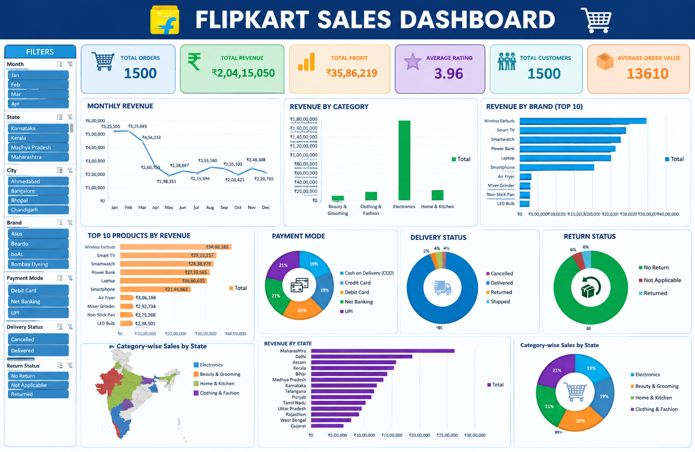

# Flipkart Sales Dashboard

Interactive Flipkart Sales Dashboard built in Microsoft Excel for analyzing sales performance, revenue, orders, customers, products, and sales trends.

## Tools & Excel Features

- Microsoft Excel
- XLOOKUP
- VLOOKUP
- PivotTables
- PivotCharts
- Excel Charts
- Slicers
- Data Cleaning
- Data Analysis
- KPI Dashboard
- Project Overview
- Tools & Excel Features
- Dashboard KPIs
- Analysis Performed
- Key Insights
- Project Structure

- ## Dashboard KPIs

- Total Revenue
- Total Profit
- Total Orders
- Total Customers
- Total Quantity

## Analysis Performed

- Monthly Revenue Analysis
- Revenue by Category
- Top 10 Brands by Revenue
- Top 10 Products by Revenue
- Revenue by State
- Payment Mode Analysis
- Delivery Status Analysis
- Return Status Analysis
- Category-wise Sales by State

## Project Objective

The objective of this project is to transform raw Flipkart sales data into an interactive Excel dashboard that helps understand sales performance and identify useful business insights.

## Key Business Insights

- Electronics is the dominant category, contributing approximately 82% of total revenue.
- Analyzed monthly revenue trends to understand sales performance over time.
- The overall return rate was approximately 2.33%, with 35 returned orders out of 1,500 total orders.
- February recorded the highest monthly revenue at approximately ₹29.77 lakh.
- Used interactive dashboard elements to support business decision-making.
- The business achieved an overall profit margin of 19.20%, indicating healthy profitability.
- Wireless Earbuds were the top revenue-generating product, contributing approximately ₹34.68 lakh.

- ## Dashboard Preview

